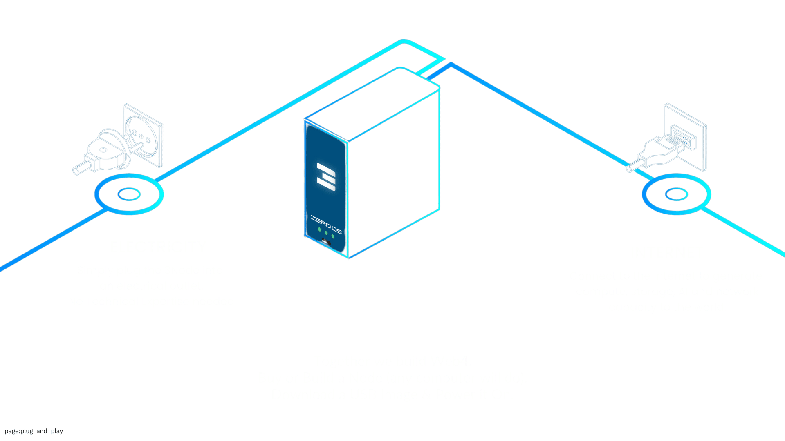
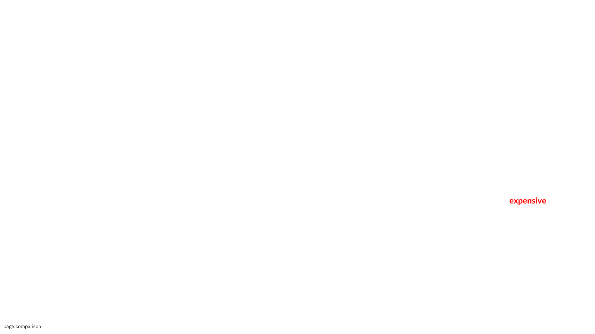

# How It Works

## What is the ThreeFold Grid?

The ThreeFold Grid 
- is capable of delivering self-healing data, network and cloud at a planetary scale.
- allows everyone, everywhere to deploy their own sovereign Internet infrastructure. 
- has been live as working proof of concept over 3 versions with thousands of nodes online.

## Web4 Decentralized Architecture

The ThreeFold decentralized architecture has key features.

- Millions of Famers in Farmingpools (v4) deliver the compute, AI, storage and network capacity required.
- Governance is done via the ThreeFold decentralized autonomous organization (DAO).
- Web 2 and 3 solution providers & hosters can use the resources on the grid see [the ThreeFold Dashboard](https://dashboard.grid.tf).
- Web 4 developers can create the apps (experiences) of the future.

## Vision

The ThreeFold Grid aims to create a more sovereign, efficient, and evolutive Internet infrastructure that returns control to individual users and reduces reliance on centralized tech giants. 

> A thriving Internet is not only possible, it is being built right now.
>
> *ThreeFold is building Web4...*
> 
> Join the grid and build with us! There are many ways to contribute and interact on the grid. 
> More information will be shared at the launch of ThreeFold V4 on **12.12.24**.

## Unique Value Propositions

With a *planet and people-first* philosophy, ThreeFold proposes a new way forward.

1. **Privacy**: Direct control over personal data
2. **Global Accessibility**: Internet infrastructure for underserved regions
3. **Sustainability**: Reduced energy consumption compared to centralized data centers
4. **Economic Empowerment**: Reward mechanism for individuals providing grid resources
5. **Community-driven**: Changes and enhancements to the grid voted by the TFDAO

## Technical Foundation

1

ThreeFold has built core technologies over the years.

- Blockchain-based resource allocation with the ThreeFold Chain (TFChain)
- Secure, transparent transaction mechanisms thanks to smart contracts
- Zero-OS: Custom lightweight operating system for nodes built on the Linux kernel
- Self-healing and automated resource management via bare metal ThreeFold nodes
- End-to-end encrypted network always using the shortest path
- Storage resistant to quantum computer attacks

## Flows

- Farmers deploy nodes to the ThreeFold Grid providing data, network and cloud resources
- Resources are verified via the **Proof-of-Capacity** minting protocol and made available for workload deployments
- Users can rent data, network and cloud resources directly through the network via the **Proof-of-Utilization** payment protocol

