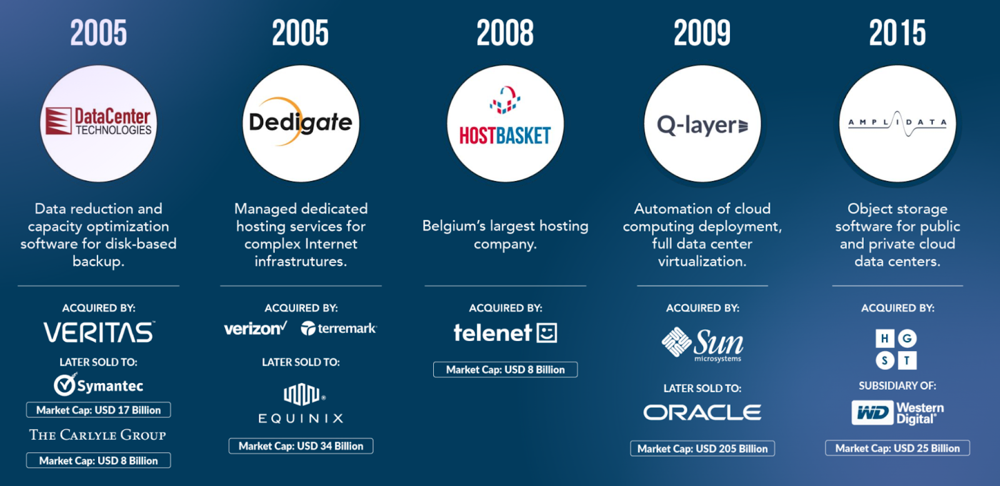
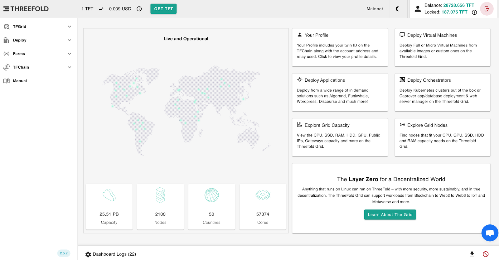

# Litepaper

> *ThreeFold is building a self-healing data, network and cloud Internet infrastructure laying the foundation for Web4.*

## ThreeFold V4 - Web4 Launch

The Internet today has major problems: it's less reliable than we think, lacks privacy and security, leaves 50% of the world poorly connected, and allows big tech to monitor and influence us. Ultimately, it enables the powerful to become even more powerful.

Web4 is the next generation of the Internet. ThreeFold has been working on it for +10 years, with over $50 million in investment and more than 50,000 active virtual CPUs.

Web4 represents the natural evolution of the Internet, where humans and artificial intelligence collaborate to develop a new paradigm focused on Augmented Collective Intelligence [^1] aimed at advancing planetary well-being while making sure everyone has equal chances.

## Mission

Our Mission is to create the best possible infrastructure layer for Web 4.0 [^2] with the following benefits:

* Sovereignty for countries, communities and people
  * Data is close to the users in their own countries
    * There is no need to build excessive data centers
  * Data is yours and managed by you
    * You decide with who your data is shared and how it is used
* Reliability
  * The current Internet is fragile and many algorithms used are outdated and unsuitable for Web4
    * Better alternatives are needed
* Privacy & security
  * The cyber pandemic is real
    * A new approach is needed to protect our digital life
* Limit centralization and provide more equality
  * Half of the world doesn’t have access to decent Internet
    * We can provide Internet to underserved regions

## Web4 Possibilities

Web4 allows “everyone everywhere” to:

* Participate in private secure online meetings (voice, video, etc.)
* Restore authenticity and determine which information can be trusted
* Discover, analyze and find information with the help of a personal AI assistant
* Keep track of all interactions with your friends and leverage a personal AI to simplify your life
* Communicate with end-to-end encryption across any link or medium, automatically finding the shortest path, even in disaster scenarios, ensuring messages remain private and unalterable
* Pay a lot less than what you would with existing systems
* Securely share and store information with ease, scaling from one person to billions
* Publish content under a unique, decentralized domain name
* Develop apps for your community up to 10x faster than with traditional systems

And soooo much more…

## A Unique Project

To our knowledge, we are the world’s first project approaching a fully functional Web4 infrastructure that places priority on both the planet and people. Over the past decade, we’ve tackled complex challenges in areas such as data storage, secure overlay networking, and autonomous cloud security to bring this vision to life.

## The ThreeFold Team

Our team has built some of the world’s most advanced Internet and cloud technologies that were later acquired by some of the biggest names in the space for a cumulative of +USD 600 million and +44% IRR for our investors.

## It’s Happening Now

A group of people have made it their life's work to resolve in a fundamental way the current Internet problems.

This team, with 6 M&A exits to date, have established +5 world records and have, with an open-source and transparent movement, demonstrated that an autonomous cloud can be created: 

**The ThreeFold Grid V3 is now comprising +55,000 vCPUs across 60 countries.**

> To learn more about the ThreeFold technology, read the [ThreeFold Tech ebook](https://threefold.info/tech)

ThreeFold is part of the **DEPIN** movement, **DE**centralized **P**hysical **IN**frastructure. It is a promising movement, but it is still in its infancy. Web4 might be a good way for this movement to expand faster. Web4 could provide liquidity and a complete ecosystem for the participants.

## Project Status

The base layer network of capacity is active. The ThreeFold technology is working currently in the third generation. 

Read the [ThreeFold V3 Manual](https://manual.grid.tf/) to learn more about the ThreeFold Grid, active in +60 countries.

## Our Web4 Implementation

ThreeFold envisions a complete Internet infrastructure to allow Web4 to come alive.

At launch, we will reveal the complete ThreeFold V4 roadmap to Web4. We provide below a glimpse of what is to come.

### Web4 Phones, Routers and Nodes

The ThreeFold Web4 Internet infrastructure will consist of a completely sustainable, peer-to-peer, encrypted and data-sovereign network of nodes, routers and phones.

### Web4 Development Platform

To develop Web4, ThreeFold V4 will establish a development platform for Web4. This should be great for those who want to dive into the tech stack we've built over the years.

### Web4 Internet Currency

To sustain this whole Web4 ecosystem, ThreeFold V4 will be rooted in a Web4 Internet currency focused on community growth and expansion.

### Web4 Marketplace

To propel Web4, ThreeFold V4 envisions a a marketplace where people can offer and use cloud, data and network resources.

> More information will be shared at the ThreeFold Web4 launch on 12.12.24

## Public Launch

Our Web4 launch is the next phase in the evolution of ThreeFold, born from a $50 million USD investment by its founders and community. We are now ready to take the project to the next level.

The official announcement will be made on December 12, 2024.

## Actionable Items 12-12-24

> More information will be shared at the ThreeFold Web4 launch on 12.12.24

## Actionable Items Q1 2025

> More information will be shared at the ThreeFold Web4 launch on 12.12.24

## Governance

> More information will be shared at the ThreeFold Web4 launch on 12.12.24

## The Internet as Hope for Humanity

At ThreeFold, we believe that the Internet represents an amazing opportunity that brings hope for humanity. We envision the Internet as a freeflow of authentic information, connecting everyone where, unlocking the unlimited potential of humanity. This world is within reach and we are building it as we speak. We invite everyone to join the ThreeFold ecoystem and to collaborate as they feel inspired.

We think that it is possible to collectively build and improve the Internet so as it unlocks its unlimited potential to humanity.

***Let's do it.***

---

[^1]: [Augmented Collective Intelligence - Supermind](https://www.supermind.design/)
[^2]: [Web4 - Techopedia](https://www.techopedia.com/definition/web4)