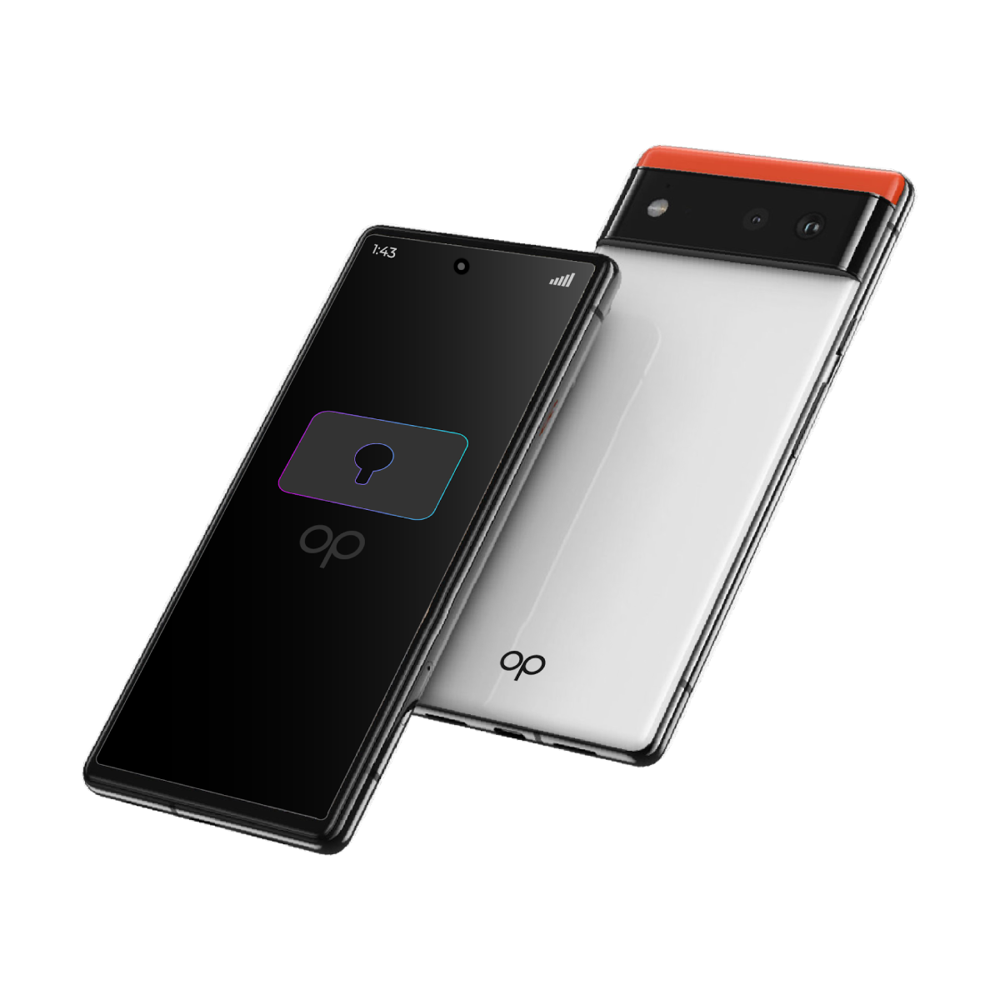

# Phones & Routers

Today the grid is a network of more than 2,000 ThreeFold nodes which deliver **IN**ternet **CA**pacity in more than 50 countries.

We are now adding two new components: 

- Secure ThreeFold Phones
  - Which is linked to our our Web4 Agent and interconnects with the global secure ThreeFold Grid
- ThreeFold Self-Healing Routers
  - These routers offer seamless connectivity for everyone, everywhere

Both of these components are compatible with Web2 (the current internet) and Web3 (blockchain technology).

> More information will be shared at the ThreeFold Web4 launch on 12.12.24.