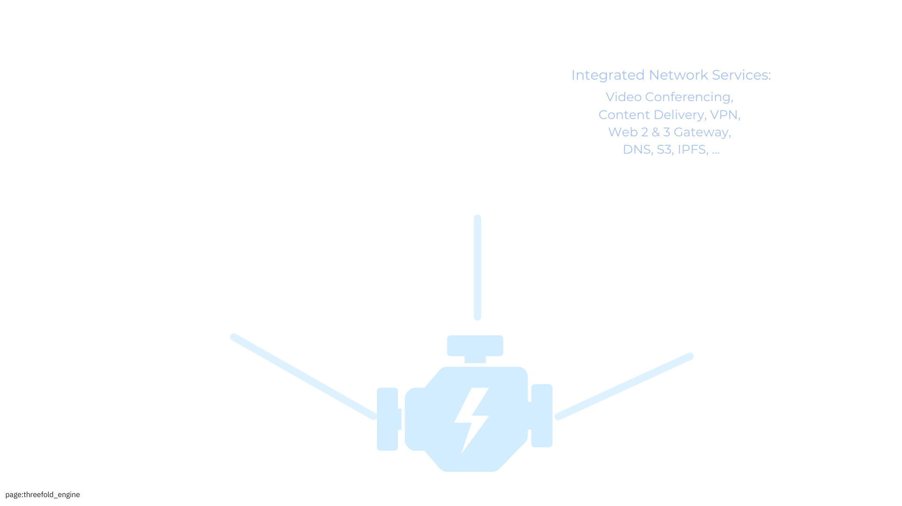
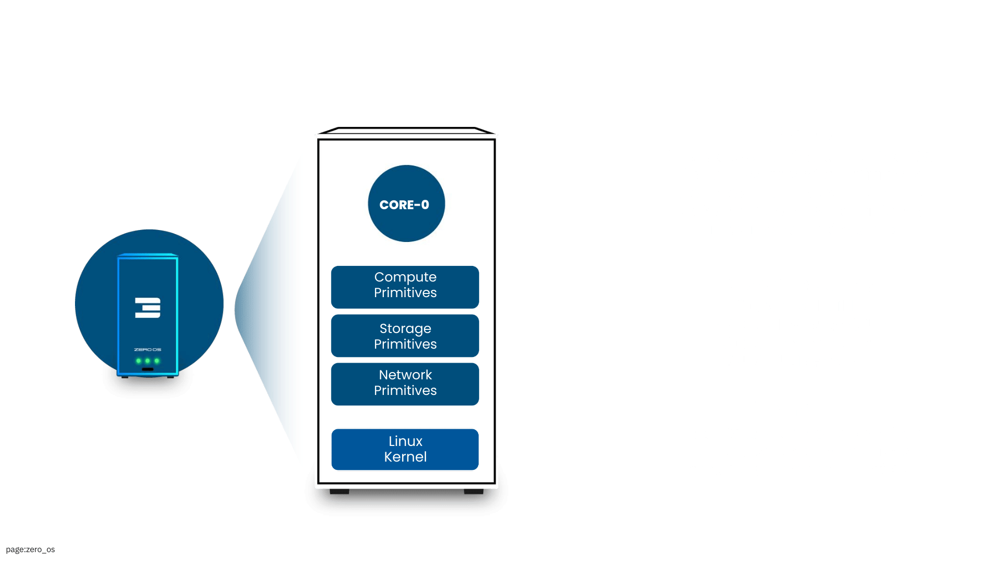

# Technology

ThreeFold delivers the plumbing layer for a better Internet which has the potential to achieve Augmented Collective Intelligence[^1]. We call such a system **Web4**.

> *ThreeFold might be the only platform in the world providing Web4 Network, Data and Cloud Capabilities in one system.*

## 3 Required Levels

Together with our partners, we have all required parts to make it happen on 3 levels:

### Personal Level: 	

- Agent Layer: Every person owns a Personal Digital Assistant, managing their digital life.
- Identity Layer: Strong reputation management, proof of authenticity, a global name system.
- Intelligence Layer: Decentralized, personal AI systems for collaboration & augmented intelligence.
- Transaction Layer: Fully integrated with Web3 systems and beyond, e.g. mutual credit, … 

### Infrastructure Level:

- Network Layer: Redesign of how communication happens with a private and more scalable network layer.
- Data Layer: Redesign of how we share, distribute and store data.
- Serverless Compute Layer: Allow code to run close to where participants and data are.
- Cloud Layer: Run VMs and containers as part of the ecosystem with Web2 compatibility layer.

### Physical Level

- Routers: Route between old and new web, and create new secure communication channels.
- Nodes: Deliver AI, Data, Compute to the ecosystem.
- Phones: Our personal device, capable of building a meshed network, offline support with catchup.
- Desktops: Any current Linux, Windows, macOS desktop seamlessly integrates.

The following are the required components to make all this possible:

- Zero-OS: Custom lightweight operating system for nodes built on the Linux kernel.
  - Self-healing and automated resource management via bare metal ThreeFold nodes.
- Mycelium: End-to-end encrypted network always using the shortest path.
- Quantum Safe Storage resistant to quantum computer attacks and data can never be lost.
- Hero Agent (v4): Ready to build the apps of the future in full compatibility with web3. 
- Smart Contract for IT: Blockchain-based resource allocation with signed contracts.
  - Secure, transparent transaction mechanisms for deployment of solutions on the ThreeFold Grid.

> For more information, read the [ThreeFold Tech ebook](https://threefold.info/tech).

---

[^1]: [Augmented Collective Intelligence - Supermind](https://www.supermind.design/)