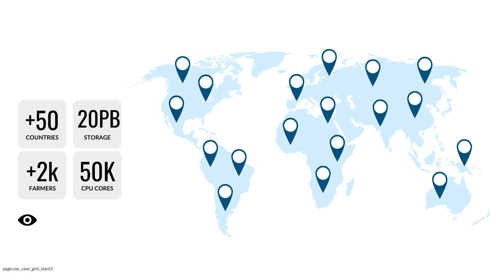

# How to Use

The current grid is usable for people who have some technical background and know how to use cloud technologies.

- Our current deployment is in more than 50 countries and has plenty of features.

We are working on the generation 4 of the ThreeFold Grid, which will have the following additional features:

- Service Level Management
  - As a user of the Internet capacity you get a guarantee from the farmers
- Farming Pools
  - Pools of capacity with defined service level and pricing
- Dynamic Pricing
  - Each farmer/farming pool can define their own pricing in line to service levels and performance.
- Development platform for Web4
  - This will be an agent-centric paradigm of the future.

### Which Workloads

Any AI, Web2 and Web3 workloads, as well as any blockchain app, can be deployed on the grid today.

### For Who

Developers, as well as system administrators, can use the ThreeFold Grid.

Today, system administrators already have access to a large variety of tools to get started today. Read more below.

> *On 12-12-2024, we will announce what developers can build on top of the ThreeFold Grid.*

A true Web4 system must be flexible, enabling anyone, anywhere, to build on top of it.

### System Administrators & Web2+Web3 Enthusiasts

ThreeFold has made the ThreeFold Grid compatible with industry standards used today in the cloud landscape.

You can deploy:

- Virtual Machines
- Containers
  - Compatible with Docker
- Kubernetes Clusters
  - Compatible with the world
  - With additional network capabilities
- Multiple Network Technologies
  - To connect the virtual machines & containers
- AI Workloads
  - Use GPU from the containers or virtual machines
- Web Gateways
  - Connect your running workload to the Internet
- Web3 workloads
  - Anything which can run on Linux today can run on top of the ThreeFold Grid
    - e.g. blockchain validators, etc. 

If you know how to write scripts, then you can build wonderful automated solutions on top of the grid.

> [All required information can be found in our ThreeFold V3 Manual.](https://manual.grid.tf/documentation/system_administrators/system_administrators.html)
