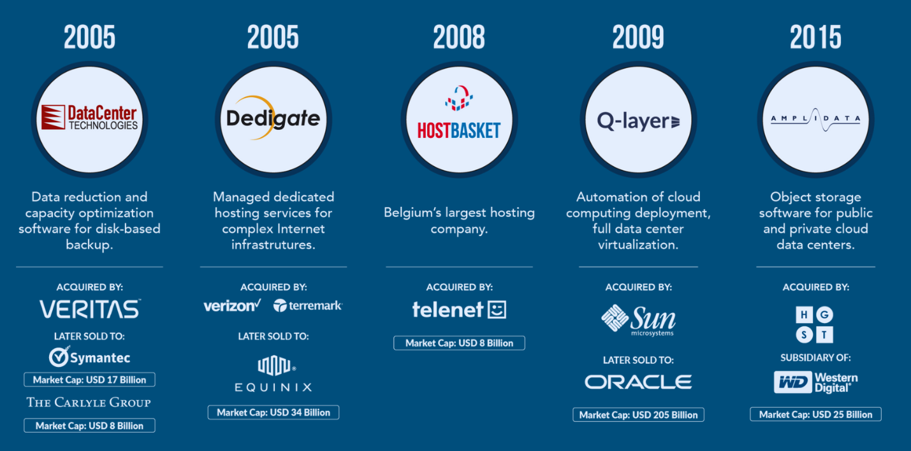
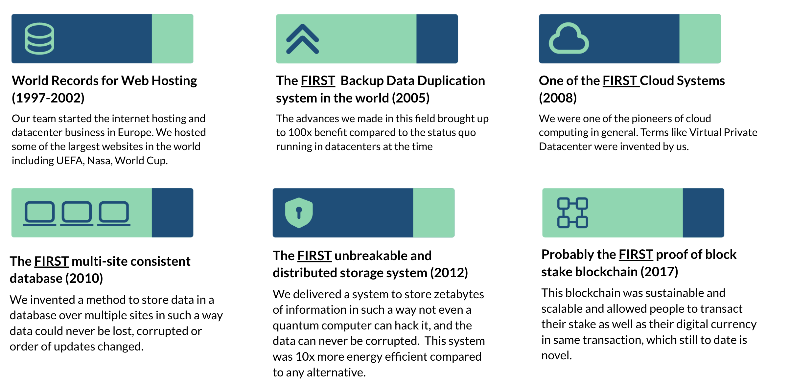
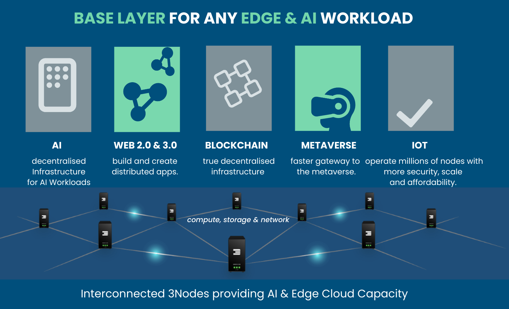
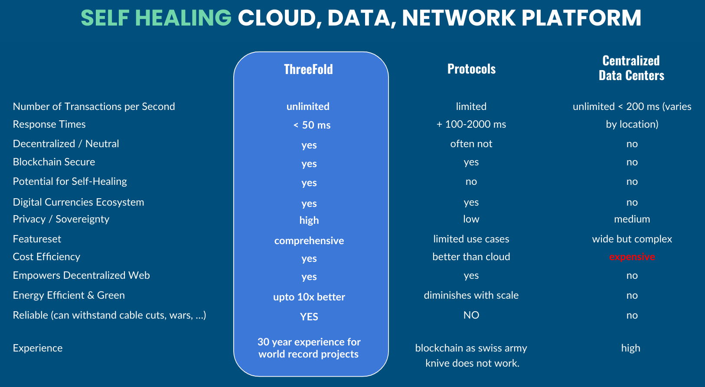

# Litepaper

> *ThreeFold presents Project Mycelium, a self-healing data, network and cloud Internet insfrastructure laying the foundation for Web4.*

## Evolution of the Internet

### 1960-2000

Originally, the Internet was a free, trustworthy, and peer-to-peer network where collaboration and open communication flourished, laying the foundation for a decentralized vision which we aim to restore today.

### 2000-Present

Between 2000 and now, the Internet has lost its authenticity, becoming increasingly insecure and dominated by commercial interests, compromising the origin vision of a free and open digital space

### Here and Now

We're pioneering a new, autonomous cloud engine that is ultra-secure, green, scalable, and easy to use, delivering a fresh approach to the requirements of a global platform for augmented collective intelligence

## Internet's Natural Progression

The Internet was always meant to be a peer-to-peer infrastructure.

### Web 1.0 & 2.0: Centralized Data

Web 1.0 & 2.0 was people-driven and in essence too way too complex. It was focused on centralized data and was power hungry. It was slow and unscalable. In short, it was too expensive for what it provided.

### Web 3.0 & Blockchain: Share Data

The Web 3.0 & Blockchain was a necessary step and progression, provising solutions to money transfer and smart contracts. Though these services are indispensable and effective, they were and are in essence not usable to build a whole internet (TODO: new internet?). In its infrastructure, it was often too centralized and lacking sovereignty. This technology has its uses, but it is hard to scale and to make private. It also complicated a lot of work for developers

### Web 4.0 & Internet 2.0: Sovereign Data

Web 4.0 & Internet 2.0 lead to an ecosystem that is driven by human and also AI. It is thus an human-AI hybrid internet. This Internet can be sovereign & decentralized, while being totally secure and private. This phase of the Internet can scale indefinitely, is green, self-healing, cost effective and ultra-reliable.

## Internet for All?

Internet is currently not accessible to all. Indeed, the Internet is only available to 50% of the world. As per Fortune, as of 2023, "Only 1 in 3 African women have access to the internet-compared with half of man." One of the main goals of ThreeFold is to enable Internet access to people worldwide.

## GDP Negative Internet

Currently, for almost all countries, the Internet is GPD negative, meaning that the costs associated with building, maintaining, and securing the internet outweigh its economic benefits.

Sea cables are the mode of transportation for internet data. With most large data centers being located in a handful of countries, nations are losing numerous benefits.

This means that there is an amazingly high potential for countries to own their Internet infrastructure and systems. By implementing the technology developed by ThreeFold, the Internet GDP of countries can go from negative to positive.

## ThreeFold Ecosystem

### ThreeFold Grid

The ThreeFold Grid is the result of more than 10 years of work by a dedicated team of passionate indivuals. The grid offers a true decentralized AI, cloud and storage platform with end-to-end encrypted network as a viable and production-ready alternative to power hungry centralized datacenters. The grid provides self-healing capabilities, is ultra-sustainable and has an active community. Currently, 50 M USD has been invested in its ecosystem. The grid is present in more than 60 countries with thousands of nodes.

### The Team

We build on a successful track record. Indeed, our team has built some of the world's most advanced internet and cloud technologies that were later acquired by some of the biggeset names in the space for a cumulative of +USD 600 million.

### World Records

Moreover, our team has set numerous world records, notably world records for web hosting (1997-2002), the first backup data duplication system in the world (2005), one of the first cloud systems (2008), the first multi-site consistent database (2010), the first unbreakable and distributed storage system (2012) and probably the first proof-of-block stake blockchain (2017).

### Our Values

At ThreeFold, we believe that being planet and people first, i.e. never do anything which is not respecting mother earth, and equality for everyone, are a vital combination to a thriving and beneficial ecosystem.

We believe in authenticity, to restore authenticity of people and information, in open-source, for healthcare, legal, software, education, in simplicity, as we believe that complexity is killing progress.

## The Problem

The current model has clear limitations. Too many many abstraction layers results in bad efficiency, performance loss, increased management costs, and scalability challenges.

### Limitations

There are actually many limitations to the current model. Those limitations are rooted in centralization and complexity.

- **Easily Hacked**
  - Centralized data centers allow hackers to easily jeopardize data due to a single point of attack. Global cybersecurity damage crossed USD 6 trillion in 2022.

- **Not Scalable Enough**
  - The current infrastructure has limits to how fast and how far it can expand, is not self-managing requires human oversight, Leaving +3 billion people unconnected.

- **Burden to the Planet**
  - Current storage and compute systems are too power hungry. They now consume a large part of the world’s energy. They are a huge burden on the planet.

- **Susceptible in Conflicts**
  - Centralized data centers are susceptible to attacks during conflict. An entire country's ICT systems can be jeopardized if their data centers are damaged or compromised.

- **Reliable Enough**
  - Current systems are too complex and centrally managed (by people) which leads to unsafe and suboptimal security and reliability. Networks are unreliable and not efficient.

- **Lack of Data Sovereignty**
  - Where a country’s data is stored is now critical to its sovereignty. Many nations are now looking for local storage to minimize manipulation by data-hosting countries.

- **Poor Use of Computer Hardware**
  - The cloud world does not utilize computer hardware well. Hardware advancements surged, while experiences and features stagnated, unable to match the pace.

### Superficial Fixes

While there are some partial solutions out there, most of the times, they never solve issues at the root. When this happens, abstract layers compound complexity. 

- **Abstraction**
  - IT companies prefer to integrate rather then to create novel solutions. Abstractions are needed to keep it all functioning but leads to complexity and inefficiency.
- **Mismatched Education**
  - There is a focus on commercial technologies rather than groundbreaking innovations often driven by vendors.
- **Pain Killer Approach**
  - Starts often prioritize quick solutions for immediate pain points instead of long-term innovation.
- **Keep On Creating Layers**
  - Layering allows incremental development, compatibility, and minimizes disruptions, all the while making true change impossible.

## The Solution

ThreeFold literally offers an all-one solution to the current problems the world is facing in the IT and cloud world.

We are not dreaming of a better Internet, we are building it. To fix at the root all thoses issues, ThreeFold built a self-healing cloud, network and data platform.

### The Layers of the Internet

The Internet can be seen as three main layers:

- Cloud & Data
- Network
- Applications

The ThreeFold Platform ensures that those 3 layers are properly taken care of. The ThreeFold self-healing system has the capability to restore the Internet to its original purpose: unlimited collaboration and creativity, authentic information sharing without publicity, addition-free social networks, and more.

### The ThreeFold Engine

As far as we know, we have created the only system in the world capable to deliver self-healing data, network and cloud at a planetary scale. We are not a protocol.

- **Fungistor**
  - An indestructible, infinitely scalable, efficient data storage and distribution system that needs 3x less energy and disks.
- **Mycelium Network**
  - An indestructible network that connact any machine or human over the shortest path possible over any medium and for any use case allowing for integrated network services such as video conferencing, content delivery, VPN, web 2 and 3 gateways, DNS, S3, IPFS, and more.
- **Magic Cloud**
  - A self-healing multi-node cluster for any AI, Web 2 and 3 workloads. Magic Cloud is easy to use and manage, scales globally, ultra-redundant, provides high performances and is super secure.

The ThreeFold Engine is the base layer for any cloud, edge and AI workloads.

### 3 Core Inventions

ThreeFold has built many technology over the years. Among the stack of technology created, three main inventions constitute the core of the ThreeFold Platform:

- **A new bare metal operating system**
  - Zero-OS supports all required Web2 and Web3 workloads and allows millions of nodes to operate in full autonomous mode providing lower cost, better energy efficiency, more reliability and security
- **A Quantum Safe Storage System**
  - The Quantum Safe Storage System is capable of storing data indestructible, efficient, and ultra-scalable. Previous versions of this system are widely used to store Zetabytes of information by large organizations.
- **A Quantum Safe Network System**
  - Mycelium can look for the shortest path, has a built-in naming & CDN (Content Delivery) system, can survive disaster and network cuts much more efficiently as is possible today.

## Trillion-Dollar Market

There is currently an untapped trillion-dollar cloud and cyber security market. ThreeFold has an antidote for the cyperpandemic. Indeed, trillions worth of USD are lost each year because of the ongoing cyberpandemic. Our solution offers a pro-active different approach to this problem.

The trillion USD AI and Edge workloads market needs a different engine which is more scalable, secure and reliable.

Countries are looking for solutions which are sovereign and allow them to restore the huge imbalance created over the years.

The ThreeFold Platform can provide products and services for this trillion dollar market.

## Products

ThreeFold has developed products that make the most of the technology we've built over the years. 

### Phones

> Coming soon. Project Mycelium Launch 12-12-24

### Nodes

> Coming soon. Project Mycelium Launch 12-12-24

### Routers

> Coming soon. Project Mycelium Launch 12-12-24

## Best of Both Worlds

The ThreeFold technology is the best of both worlds. You can get the benefits of both the protocols and the centralized data centers without any of the downsides.

The figure below compares the ThreeFold Platform with the protocols and centralized data centers.

## ThreeFold Platform

It all starts with the ThreeFold Platform. The ThreeFold Platform offers edge AI and a complete cloud platform. This enables anyone in the world to access the nearest ThreeFold nodes via the Mycelium network, always finding the shortest path.

You can deploy a ThreeFold node in your home, in a datacenter or in any commercial settings. ThreeFold nodes can host the ThreeFold AI assistant called Hero, helping you in everyday task and enterprises while always being secure, encrypted and private. 

The nodes within the grid, connected via the Mycelium network, enhanced by the Hero AI assistant create a complementary unbreakable Internet compatible with the current one. This means that you can harness the full potential of the current Internet and the culmulation of humankind knowledge via the ThreeFold Platform Engine privately and securely.

## The Internet as Hope for Humanity

At ThreeFold, we believe that the Internet represents an amazing opportunity that brings hope for humanity. We envision a world where we can all own our AI, data and Internet. This world is within reach and we are building it as we speak. We invite everyone to join the ThreeFold ecoystem and to collaborate as they feel inspired.

We think that it is possible to collective build and improve the internet so as it unlocks its unlimited potential of humanity. 

We envision the internet as a freeflow of authentic information, connecting everyone where, unlocking the unlimited potential of humanity.

## Learn More

To learn more about the ThreeFold technology, read the [ThreeFold Technology Ebook](https://threefold.info/tech).