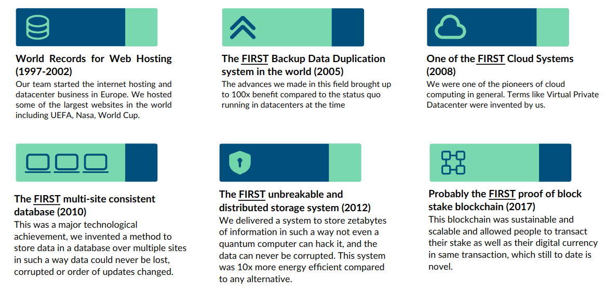
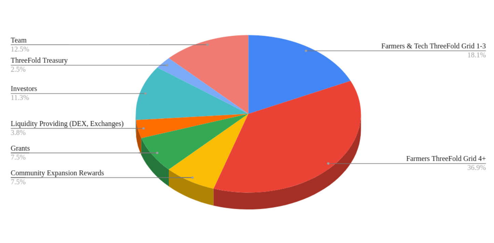
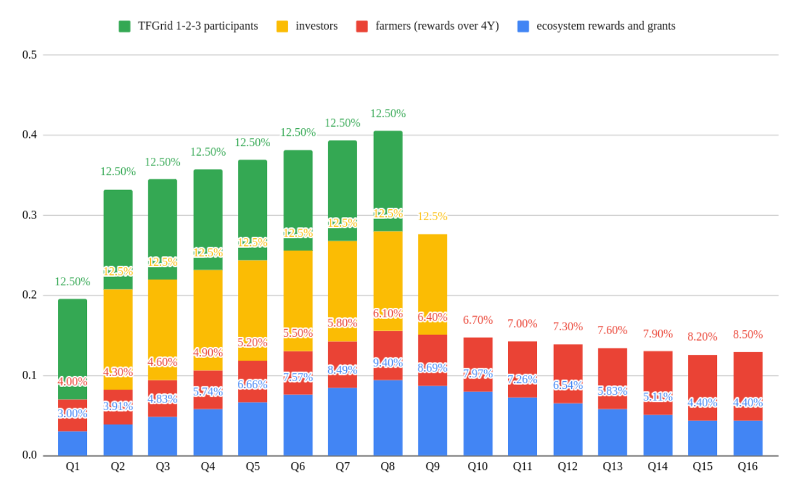

# Litepaper

> *The following document presents the version 4 of ThreeFold, a complete and resilient autonomous cloud engine enabling Augmented Collective Intelligence for everyone, everywhere.*

## Evolution of the Internet

### 1960-2000

Originally, the Internet was a free, trustworthy, and peer-to-peer network where collaboration and open communication flourished, laying the foundation for a decentralized vision which we aim to restore today.

### 2000-Present

Between 2000 and now, the Internet has lost its authenticity, becoming increasingly insecure and dominated by commercial interests, compromising the origin vision of a free and open digital space

### Here and Now

We're pioneering a new, autonomous cloud engine that is ultra-secure, green, scalable, and easy to use, delivering a fresh approach to the requirements of a global platform for augmented collective intelligence

## Internet's Natural Progression

The Internet was always meant to be a peer-to-peer infrastructure.

### Web 1.0 & 2.0: Centralized Data

Web 1.0 & 2.0 was people-driven and in essence too way too complex. It was focused on centralized data and was power hungry. It was slow and unscalable. In short, it was too expensive for what it provided.

### Web 3.0 & Blockchain: Share Data

The Web 3.0 & Blockchain was a necessary step and progression, provising solutions to money transfer and smart contracts. Though these services are indispensable and effective, they were and are in essence not usable to build a whole internet (TODO: new internet?). In its infrastructure, it was often too centralized and lacking sovereignty. This technology has its uses, but it is hard to scale and to make private. It also complicated a lot of work for developers

### Web 4.0 & Internet 2.0: Sovereign Data

Web 4.0 & Internet 2.0 lead to an ecosystem that is driven by human and also AI. It is thus an human-AI hybrid internet. This Internet can be sovereign & decentralized, while being totally secure and private. This phase of the Internet can scale indefinitely, is green, self-healing, cost effective and ultra-reliable.

## Internet for All?

Internet is currently not accessible to all. Indeed, the Internet is only available to 50% of the world. As per Fortune, as of 2023, "Only 1 in 3 African women have access to the internet-compared with half of man."

## GDP Negative Internet

Currently, for almost all countries, the Internet is GPD negative, meaning that the costs associated with building, maintaining, and securing the internet outweigh its economic benefits.

See cables are the mode of transportation for internet data. With most large data centers being located in a handful of countries, nations are losing numerous benefits.

This means that there is an amazingly high potential for countries to own their Internet infrastructure and systems.

## ThreeFold Ecosystem

### ThreeFold Grid

The ThreeFold Grid is the result of more than 10 years of work by a dedicated team of passionate indivuals. The grid offers a true decentralized AI, cloud and storage platform with end-to-end encrypted network as a viable and production-ready alternative to power hungry centralized datacenters. The grid provides self-healing capabilities, is ultra-sustainable and has an active community. Currently, 50 M USD has been invested in its ecosystem. The grid is present in more than 60 countries with thousands of nodes.

### The Team

We build on a successful track record. Indeed, our team has built some of the world's most advanced internet and cloud technologies that were later acquired by some of the biggeset names in the space for a cumulative of +USD 600 million and +44% IRR for our investors.

Moreover, our team has set numerous world records, notably world records for web hosting (1997-2002), the first backup data duplication system in the world (2005), one of the first cloud systems (2008), the first multi-site consistent database (2010), the first unbreakable and distributed storage system (2012) and probably the first proof-of-block stake blockchain (2017).

### Our Values

At ThreeFold, we believe that being planet and people first, i.e. never do anything which is not respecting mother earth, and equality for everyone, are a vital combination to a thriving and beneficial ecosystem.

We believe in authenticity, to restore authenticity of people and information, in open-source, for healthcare, legal, software, education, in simplicity, as we believe that complexity is killing progress.

## Augmented Collective Intelligence

At ThreeFold, we are building an augmented collective intelligence to solve tomorrow's problems with tomorrow's intelligence.

While artificial general intelligence is on its way, we believe that a proportionate and effective answer is to build for everyone an augmented collective intelligence for making humans more intelligent. The Augmented Collective Intelligence harnesses the emergent intelligece of large numbers of people and AI-powered machines, all connected in a distributed architecture.

While Artificial General Intelligence is based on AI: machine learning, neural networks, semantic, code and images, Augmented Collective Intelligence is both rooted in AI as described previously, but also has a strong focus on human-machine networks, knowledge graphs, symbolic and abstract reasoning.

In essence, Augmented Collective Intelligence incorporates both the laser-sharp effectivness of AI and also the inspired and intuitive thinking of the humand mind.

This Augmented Collective Intelligence is possible thanks to the ThreeFold's cloud, network and AI capabilities of the grid. 

## ThreeFold Cloud

It all starts with the ThreeFold Cloud. The ThreeFold Cloud offers edge Ai and a complete cloud platform. This enables anyone in the world to access the nearest ThreeFold nodes via the Mycelium network, always finding the shortest path.

You can deploy a ThreeFold node in your home, in a datacenter or in any commercial settings. ThreeFold nodes can host the ThreeFold AI assistant called Hero, helping you in everyday task and enterprises while always being secure, encrypted and private. 

The nodes within the grid, connected via the Mycelium network, enhanced by the Hero AI assistant create a complementary unbreakable Internet compatible with the current one. This means that you can harness the full potential of the current Internet and the culmulation of humankind knowledge via the ThreeFold Cloud Engine: privately and securely 

### Use Cases

The ThreeFold ecosystem throughout the years developed and built strong partnerships and projects over the world.

Among endless use cases, here is a list of active partnerships and use cases:

- Tier S Datacenter
  - Ultra-secure and energy efficient (up to 40% lower OPEX) data center solutions
- Holochain
  - Peer-to-peer transaction layer and Dapp layer on top of TFGrid 
- Digital Freezone
  - A digital freezone made for hundreds of millions of people
- Tanzania Sovereign Internet
  - A sovereign Internet for a country 
- Mkondo
  - Most realistic rendering of VR/AR env on top of TFGrid
- Vindo
  - Collaborative metaverse, best quality at low bandwidth 
- Vverse
  - Virtual reality museum 
- Sikana 
  - Virtual learning platfrom

## The Internet as Hope for Humanity

At ThreeFold, we believe that the Internet represents an amazing opportunity that brings hope for humanity. We envision a world where we can all own our AI, data and Internet. This world is within reach and we are building it as we speak. We invite everyone to join the ThreeFold ecoystem and to collaborate as they feel inspired.

We think that it is possible to collective build and improve the internet so as it unlocks its unlimited potential of humanity. 

We envision the internet as a freeflow of authentic information, connecting everyone where, unlocking the unlimited potential of humanity.

## INCA Token

### Expanding the Grid to Millions of Nodes

ThreeFold is now entering the expansion phase of the grid. We are expanding the grid to millions of nodes and to achieve this bold goal, we are launching the INCA token, the continuation of the ThreeFold Token, TFT. TFT has been with us for years, helping us build the most advanced and complete decentralized cloud engine out there. 

The technology is rock solid and has been tested for years on mainnet. It is now time to enter the new expansion phase of ThreeFold, where we ensure with the INCA token that the grid can expand to millions of nodes and where liquidity is optimal thanks to an innovative, fiat-ready and cross-chain marketplace.

Comprising more than 70% of TFT to the community, the INCA tokenomics ensure that the project can expand organically and provide all the resources needed for the ThreeFold community members to thrive and build. The INCA release will ensure a fair and resilient distribution.

### Tokenomics

The ThreeFold INCA Tokenomics framework for Grid 4.0 and Project INCA has been designed to promote a thriving ecosystem of cloud users, farmers, and validators. It presents a robust liquidity strategy that ensures seamless transfers and secure transactions within our cloud marketplace. Furthermore, by allocating 40 million tokens for farming grants, we're empowering individuals and organizations to contribute to the grid's growth and development.

Our proof-of-utilization rewards system distributes 80% of rewards to farmers who contribute their resources to the grid, ensuring that they're fairly compensated for their participation. Additionally, 10% of rewards are allocated to the ThreeFold Cooperative and 10% to validator commercial partners, promoting a collaborative and mutually beneficial ecosystem. 100% of the proof-of-capacity rewards go to the farmers hosting nodes on the grid.

### Distribution

The INCA token distribution plan for Grid 4.0 and Project INCA is carefully crafted to ensure a major allocation to the community. There can never be more than 4 billion tokens.

By prioritizing community growth, we're creating a collaborative environment where everyone can benefit from their contributions and participate in the project's success. This balanced distribution ensures that a significant amount of tokens is dedicated to the community, creating opportunities for growth and development within our ecosystem.

Here is a detailed version of the distribution:

- 55% of supply for Farming and Tech
  - People expanding the network with Router & Node capacity over the multiple releases
  - 18.1%: Farmers & Tech ThreeFold Grid 1-3 (+95% minted, summer 2024)
  - 36.9%: Farmers ThreeFold Grid 4+ (0% minted, summer 2024)
- 7.5% Community Expansion Rewards + Promotion
  - Promotion of the TFGrid, Marketing Activities, ... 
- 7.5% Community grants
  - We want to expand and build our project in first place together with the community
- 3.8% for liquidity providing (DEX, marketmakers, ...)
- 2.5% ThreeFold Dubai holdings (held by the company who manages and promotes the grid)
- 11.3% For Investors
- 12.5% for team and contributor rewards

> Do note this table is still under deliberation and can change

### Release Schedule

The INCA token release schedule is designed to balance the needs of different stakeholders, ensuring that everyone has access to their allocated tokens in a predictable and reliable manner. 

Investors will receive their tokens over two years, with equal tranches released at regular intervals. Farmer rewards will be released over three years, incentivizing contributors to continue building and growing the grid. Ecosystem rewards will follow a similar schedule, with token releases spanning four years to promote collaboration and participation within the community.

By releasing tokens in this predictable manner, we're creating an environment where everyone can contribute and benefit from their participation in Grid 4.0 and Project INCA.

This leads to following maximum unlocking table

The vesting accelerates if the token price gets above 0.5 USD, for each 0.1 USD above additional 10% unlocks into the INCA Liquidity pool.

Thanks to the liquidity pool, the price remains stable even if people decide to chose the option to unvest faster.

### TFT to INCA

TFT holders can go to INCA based on following rules

- There is 1-1 relationship between TFT and INCA
- TFT can only go to INCA not back.
- There is vesting implemented over 2 years
- TFT becomes INCAG token where the INCAG token has the following properties:
  - INCAG gives a given amount of INCA to be minted over 2 years
  - The distribution is of equal parts per month
  - The acceleration unlock rules are: 
    - 10% when INCA token hits 0.5 USD longer than 1 month avg out
    - 10% when INCA token hits 0.6 USD longer than 1 month avg out
    - This logic goes on 10% for each additional 0.1 USD increase until it reaches 100%

### Get INCA Tokens

There are only two ways to get INCA tokens. 

- You can reserve an INCA node to be among the first farmers out there to farm newly minted INCA. 
- You can farm the remaining TFT on ThreeFold Grid V3 and convert them to INCA with a one-to-one correspondance.

### Unlocking a Whole Ecosystem

The INCA token allows anyone to access the ThreeFold Grid, to deploy cloud and AI workloads and to benefit from the Augmented Collective Intelligence of ThreeFold: make use of AI assistants to gather the power of LLM technology. Become smarter and more effective at everything you do by unlocking the power of AI.

### Launching Soon

The INCA token is launching soon, by the end of the year or in early 2025. 

With the ThreeFold Grid V4, you will be able to deploy cloud and AI workloads on the grid, in more than 60 countries, over the quantum safe network Mycelium. You will be able to farm INCA nodes, offering cloud, AI and network resources to the world.

Be among the first farmers to mint the new INCA tokens by reserving your INCA nodes.

## Learn More

To learn more about the ThreeFold Ecosystem, read the [ThreeFold Whitepaper](https://threefold.info/projectinca) and the [ThreeFold Techpaper](https://threefold.info/tech)