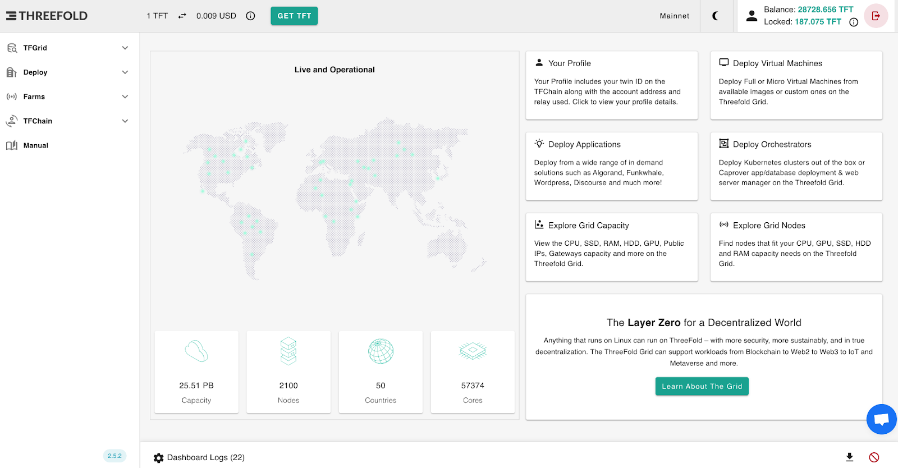
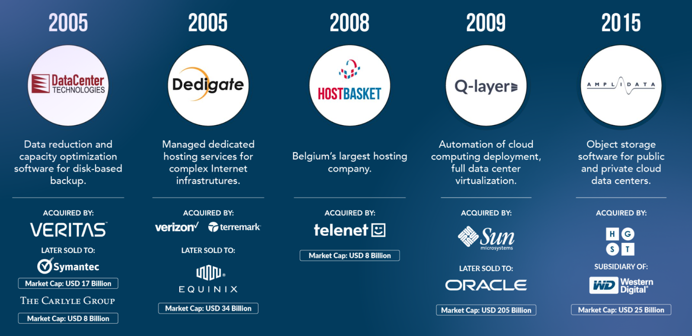

# Litepaper

> *ThreeFold is building a self-healing data, network and cloud Internet insfrastructure laying the foundation for Web4.*

## ThreeFold - Web4 Launch

The Internet today has major problems: it’s less reliable than we think, spreads misinformation, lacks privacy and security, leaves 50% of the world poorly connected, and allows big tech to monitor and influence us. Ultimately, it enables the powerful to become even more powerful.

Web 4 is the next generation of the Internet. ThreeFold has been working on it for +10 years, with over $50 million in investment and more than 50,000 active virtual CPUs

Web 4 represents the natural evolution of the Internet, where humans and artificial intelligence collaborate to develop a new paradigm focused on [Augmented Collective Intelligence,](https://www.supermind.design/) aimed at advancing planetary well-being while making sure everyone has equal chances.

## Mission

Our Mission is to create the best possible infrastructure layer for [Web 4.0](https://www.techopedia.com/definition/web4) with the following benefits:

* Sovereignty for countries, communities and people
  * Data close to the users (in our own countries, no need to build datacenters)
  * Data is ours and managed by us, we decide with who our data is shared and how it's used.
* Privacy & Security
  * The cyber pandemic is real, a new approach is needed to protect our digital life.
* Reliability
  * The current Internet is fragile and quite some algorithms used are outdated and not good enough for web4. Better alternatives are needed.
* Limit Centralization and Provide more Equality
  * Half of the world doesn’t have access to decent Internet

## Web4 Benefits to All

Web4 allows “everyone everywhere” to:

* Communicate, end-to-end encrypted across any link or medium, automatically finding the shortest path, even in disaster scenarios, ensuring messages remain private and unalterable.
* Securely share and store information with ease, scaling from one person to billions.
* Participate in private secure online meetings (video, voice, etc.).
* Publish content under a unique, decentralized domain name.
* Restore authenticity and determine which information can be trusted.
* Discover, analyze & find information with the help of a personal AI assistant
* Keep track of all interactions with your friends and leverage a personal AI to simplify your life.
* Develop apps for your community up to 10x faster than traditional systems.
* Pay a lot less than what you would do with existing systems.

And soooo much more…

## Our Web4 Implementation

> More information will be shared at the ThreeFold V4 launch on 12.12.24

## A Unique Project

To our knowledge, we are the world’s first project approaching a fully functional Web4 infrastructure that places priority on both the planet and people. Over the past decade, we’ve tackled complex challenges in areas such as data storage, secure overlay networking, and autonomous cloud security to bring this vision to life.

## It’s Happening Now

* A group of people have made it their life's work to resolve this problem in a fundamental way.
* This team, with 6 M&A exits to date, have established +5 world records and have in an opensource, transparent movement demonstrated that an autonomous cloud can be created
(now comprising +55,000 vcpu’s across 60 countries). To learn more about the ThreeFold technology, read the [ThreeFold Tech ebook](https://threefold.info/tech).
* The DEPIN movement (Decentralized Physical infrastructure), in which we are a participant, is a promising movement but is still in its infancy, it might be a good way to expand faster and provide liquidity and an ecosystem for the participants.

## Status

The base layer network of capacity is active, the technology is working in generation 3,
Read the [ThreeFold V3 Manual](https://manual.grid.tf/) to learn more about the ThreeFold Grid active in +50 countries.

## Public Launch

Our Web4 launch is the next phase in the evolution of ThreeFold, born from a $50 million USD investment by its founders and community. We are now ready to take the project to the next level.

The official announcement will be made on December 12, 2024.

## Team

Our team has built some of the world’s most advanced Internet and cloud technologies that were later acquired by some of the biggest names in the space for a cumulative +USD 600 million and +44% IRR for our investors.

## Actionable Items 12-12-24

> More information will be shared at the ThreeFold V4 launch on 12.12.24

## Actionable Items Q1 2025

> More information will be shared at the ThreeFold V4 launch on 12.12.24

## Governance

> More information will be shared at the ThreeFold V4 launch on 12.12.24

## The Internet as Hope for Humanity

At ThreeFold, we believe that the Internet represents an amazing opportunity that brings hope for humanity. We envision a world where we can all own our AI, data and Internet. This world is within reach and we are building it as we speak. We invite everyone to join the ThreeFold ecoystem and to collaborate as they feel inspired.

We think that it is possible to collectively build and improve the internet so as it unlocks its unlimited potential to humanity. 

We envision the internet as a freeflow of authentic information, connecting everyone where, unlocking the unlimited potential of humanity.