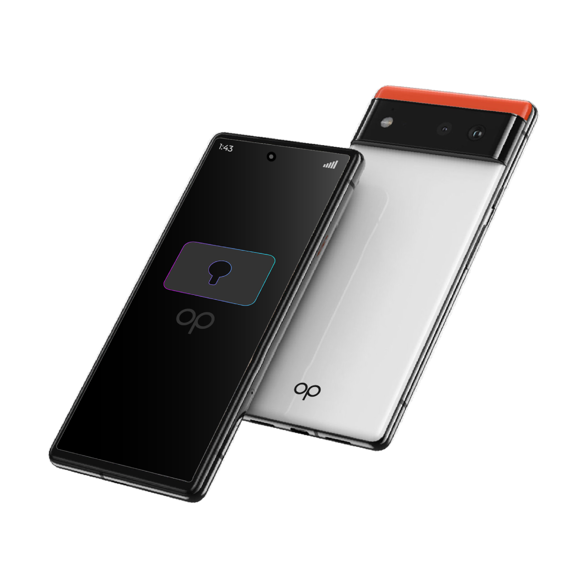

# Phones & Routers

Today the grid is a network of more than 2,000 ThreeFold Nodes which deliver INternet CApacity in more than 50 countries.

We are now adding two new components: 

- A secure phone
  - which is capable to our our Web4 Agent and interconnects with the global secure ThreeFold Network.
- ThreeFold Routers
  - seamless connectivity for everyone everywhere

Both are compatible with web 2 (current internet) and web 3 (blockchain).

> More information will be shared at the ThreeFold Web4 launch on 12.12.24