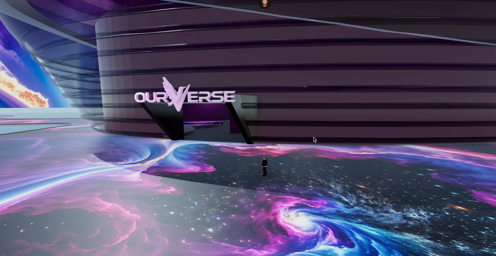

# OurVerse

## **The Future of Collaboration: Beyond Traditional Zoom Calls**

The way people collaborate is evolving beyond the boundaries of traditional video calls. OurVerse, a fully immersive metaverse platform, is at the forefront of this change, creating a space where virtual interactions feel real, engaging and truly limitless. With ThreeFold’s support, OurVerse will transform the way people from all horizons connect, create and collaborate in the digital realm.

OurVerse recently launched its AI 3D Generator, a cutting-edge system that allows users to generate entire 3D virtual environments using just text input. This innovation breaks down traditional barriers like the need for advanced technical skills or expensive software. Whether you’re a designer, educator, healthcare provider, or entrepreneur, anyone, regardless of their skill level or location can now create detailed, interactive 3D environments simply by describing them.

OurVerse, in partnership with ThreeFold, is working toward full decentralization in the coming months. This transition will create a more secure experience with ultra-fast streaming and graphic rendering, delivering pixel-perfect visuals for better global collaboration. This will position OurVerse as the first metaverse to achieve this level of quality and performance.

Together, OurVerse and ThreeFold want to push the boundaries of digital collaboration, creating a new frontier for immersive, meaningful interaction. By harnessing the potential of decentralization and AI, they believe they can make significant improvements in the quality of virtual experiences and also empower users with greater control and ownership in this new digital landscape. This collaboration lays the foundation for a future where the metaverse becomes more than just a concept, offering immersive experiences far beyond what traditional video calls or digital platforms could ever achieve.

