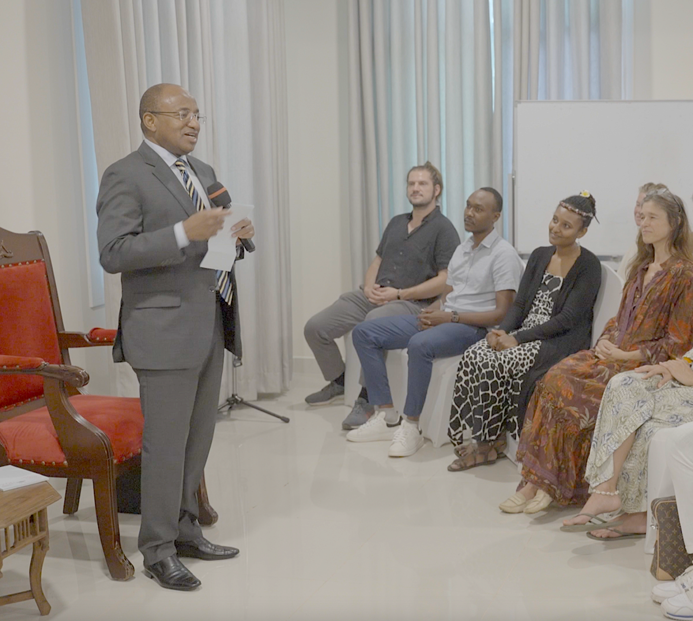

# OurWorld Freezone

## **A Sovereign Economic Zone**

Imagine if an entrepreneur, digital nomad, or any organization could obtain a digital company license, a bank account supporting both fiat and cryptocurrencies, and handle their legal requirements and taxes – all within a single streamlined platform. ThreeFold technology will be leveraged to enable just that within the world’s first 100% digital free zone – accessible and affordable for all.

The government of Zanzibar is undertaking several initiatives to shift its economy from being largely dependent on tourism to embracing the IT sector. As part of this vision they have partnered with ThreeFold via [ZICTIA](https://zictia.go.tz/), the Zanzibar ICT Infrastructure Agency, to create the world’s first digital free zone.

This collaboration was formally announced by Zanzibar’s President, Dr. Hussein Ali Mwinyi, at ThreeFold’s Africa Regenerative Future Summit in July 2023 which brought together a group of passionate entrepreneurs and actors working on innovative planet-first projects in Africa. The president promised to establish the digital free zone from a regulatory perspective, with the goal of developing local skills, bringing about major changes in the ICT sector, and creating job opportunities to increase the nation’s income.

As the world’s first digital free zone, this special economic zone will be supported by ThreeFold’s innovative tech stack. Merging traditional business structures with groundbreaking technology, the free zone will be a pioneering hub for business, fostering an ecosystem that is adaptive, resilient, and conducive to growth. It will be one of the first environments where Decentralized Autonomous Organizations (DAOs) can be legally established and operated. Some of the ThreeFold team is based in Zanzibar and working to make the free zone live by the end of 2024. 

ThreeFold’s latest technology, which is currently being fine tuned, the Digital Twin, will also be launched as part of the Free Zone membership. The Digital Free Zone (DFZ) Digital Twin application provides a centralized interface for accessing all free zone features and users will own 100% of the data and digital capabilities. You can be among the first to embark on the OurWorld Digital Free Zone journey. 

## **News Coverage**

- [The Citizen](https://www.thecitizen.co.tz/tanzania/zanzibar/zanzibar-seeks-to-become-digital-freezone--4316150)
- [Daily News Tanzania](https://dailynews.co.tz/mwinyi-commits-to-improvement-of-digital-spaces/)