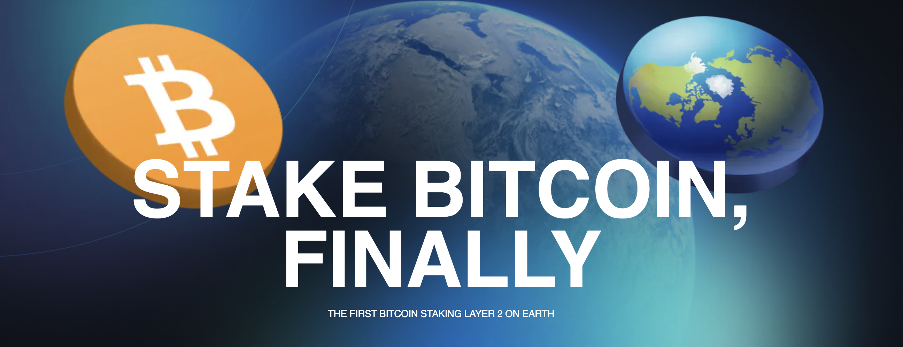

# Social Network

## **Scaling Bitcoin**
Earth Staking’s Social Network is the first Bitcoin Staking Layer 2 on Earth, designed to provide users with a more cost-effective, efficient and eco-friendly experience. Their mission is to decentralize scaling solutions for Bitcoin and create social networks that prioritize the well-being of Earth and its inhabitants. Having jointly identified challenges currently confronting Bitcoin and its alternatives, ThreeFold and Social Network have partnered together to improve the accessibility, security, scalability, reliability and energy efficiency of the Bitcoin Network.  

Social Network will be integrated with and enhanced by ThreeFold technologies. This includes, but is not limited to, ThreeFold’s decentralized cloud – featuring Quantum Safe Storage and the Mycelium Network – as well as decentralized computation, and Zero OS. ThreeFold's infrastructure provides the ideal backbone for Earth Staking's ambitions, offering a robust, low-level decentralized framework perfectly suited to empower its vision.

The partnership is also focused on advancing the development of cross-chain communication technology for Bitcoin, Ethereum, and others – enhancing scale, security, ease of use, and energy efficiency. To this end, ThreeFold and Earth Staking will look to create a seamless, frictionless, easy-to-use EarthWallet and node with built-in BTC Staking, ETH Light, and Nostr functionalities. 

Our partnership agreement was formalized in January 2024 and we are now in the process of technical implementation.

