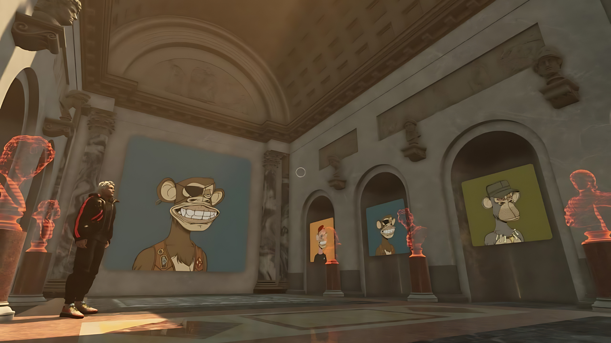

# Veverse

## **A Metaverse Eradicating Cultural Boundaries**

VeVerse aims to create a virtual universe which eradicates cultural boundaries and supports the free flow of ideas and knowledge. The vision is to provide a metaverse platform which bridges virtual worlds, digital assets and communities and to empower museums, artists and game developers to construct captivating environments together where users can play, explore and connect.

One of the critical moments which inspired this project was when VeVerse’s founder, Vasily Gnuchev, traveled to Egypt. In his own words “experiencing the rich history and art of this ancient civilization firsthand, I became even more determined to create a platform where such wonders could be shared with people worldwide.” It was on this trip Vasily met ThreeFold co-founder Kristof De Spiegeleer, who shared a passion for art and decentralization and whose encouragement played a crucial role in propelling VeVerse’s first project, Artheon, forward. Artheon is a virtual museum which breaks down cultural barriers by providing global access to artistic masterpieces. Check out this fascinating project [here](https://artheon3d.veverse.com/) and visualize it in the video below.

One of the problems facing VeVerse, and all other metaverse products in existence, is the inadequate computational and connectivity infrastructure available today. Current infrastructure lacks the speed and capacity to power such expansive digital experiences. Latency levels are also significantly higher than the almost zero latency requirements of metaverse data being stored in close proximity to users. Edge computing emerges as a vital solution to realizing the metaverse, offering decentralized local data storage hardware that drastically reduces latency by storing data closer to users. This is where ThreeFold steps in as a pivotal player, offering the largest decentralized grid globally, equipped with edge cloud and computing capabilities essential for powering the metaverse's future. The partnership between ThreeFold and VeVerse will help bring cultural artworks and historical artifacts to billions. Help host this innovative solution by expanding ThreeFold’s cloud capacity.