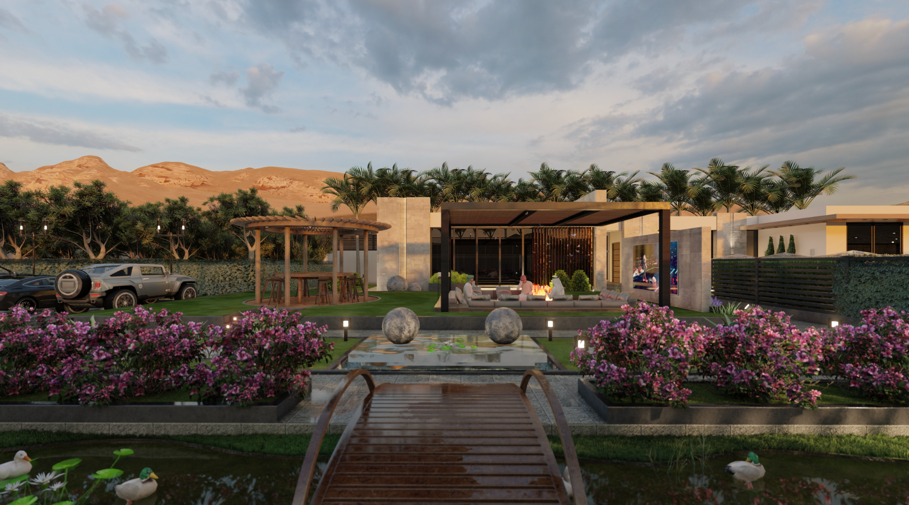

# Vverse

## **A Cutting-edge Metaverse Platform**

VVerse offers a cutting-edge platform for virtual socializing and entertainment. One of their first products is [VinDo](https://www.vindo.ai/), the next generation communication and business tool to streamline your interactions, empower your business, simplify your workflow and amplify your results. Businesses can become virtual with VinDO and redefine customer experiences in the metaverse. Checkout the video below to see this metaverse in action.

VVerse has chosen to partner with ThreeFold as its infrastructure partner due to its unparalleled capabilities in powering the metaverse's evolution. With ThreeFold's decentralized grid and edge cloud computing, VVerse aims to overcome the limitations of current infrastructure, particularly in terms of latency and scalability. ThreeFold's edge cloud infrastructure minimizes latency, enabling real-time interactions in VR and AR settings. Users will experience seamless interactions and immersive experiences without delays. As VVerse anticipates an influx of users engaging in diverse activities simultaneously, ThreeFold's infrastructure offers scalable solutions. This ensures that the platform can efficiently handle spikes in demand, providing a smooth experience for all users.

Through strategic partnerships with metaverse innovators like VVerse, ThreeFold is paving the way for a future where digital and physical realities seamlessly coalesce. Together, these efforts propel the metaverse towards its full potential, revolutionizing digital experiences for users worldwide.