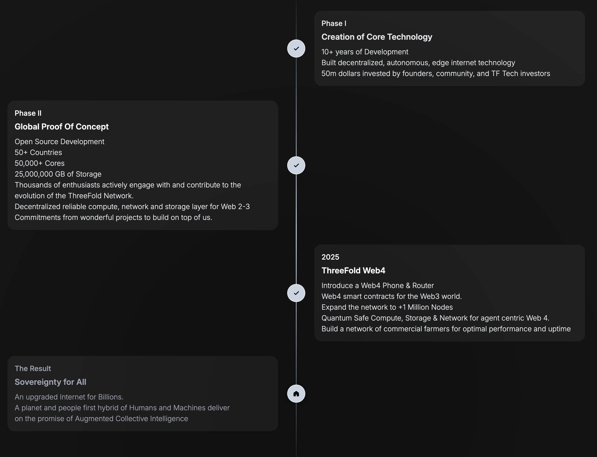

# Roadmap

ThreeFold is on its way to build Web4, the natural evolution of the Internet, where humans and artificial intelligence collaborate to develop a new paradigm aimed at advancing planetary well-being while making sure everyone has equal chances.

To achieve this, ThreeFold is building a self-healing data, network and cloud ecosystem composed of phones, routers and nodes. This platform is a complete and cohesive system providing a viable and efficient alternative to current mainstream clouds. 

## On our Way to Web4

ThreeFold has accomplished so much over the years, we are currently in the fourth phase of the grid, making significant progress towards building a viable alternative to mainstream centralized internet and cloud services.

- We are building a decentralized sovereign alternative to today's centralized Internet model.
- We are making significant progress towards realizing this vision. We present here the currently available features and the features that will be available in a near future.

Currently, the ThreeFold grid is in more than 50 countries with thousands of nodes online providing data, network and cloud resources to users as a working Proof of Concept. 

ThreeFold will be announcing more Web4 features on 12.12.24.

| Status    | System Component |
|-----------|--------------|
| ✓ Completed | ThreeFold Infrastructure Layer for web 2..3..4 |
| ✓ Completed | ThreeFold Dashboard |
| ✓ Completed | ThreeFold Connect |
| ✓ Completed | ThreeFold Nodes |
| ✓ Completed | ThreeFold Kubernetes, Virtual Machines, Containers, ... |
| ✓ Completed | Quantum Safe Storage and File System |
| ✓ Completed | Mycelium Quantum Safe Network |
| ✓ Completed | Mycelium Web2 Gateway |
| ✓ Completed | Mycelium Message Bus |
| 🔄 Announce - 12.12.24 | Web4 Phone  |
| 🔄 Announce - 12.12.24 | Web4 Router  |
| 🔄 Announce - 12.12.24 | Web4 Development Platform  |

> [https://threefold.io/action/](https://threefold.io/action)