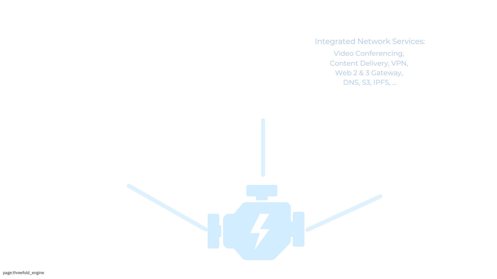
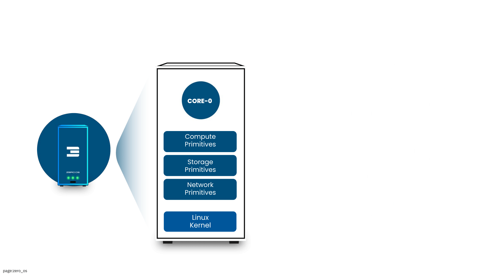

# Technology

ThreeFold delivers the plumbing layer for a better Internet which has the potential to achieve [Augmented Collective Intelligence](https://www.supermind.design/). We call such a system Web4.

> *ThreeFold might be the only platform in the world providing Web4 Network, Data and Cloud Capabilities in 1 system.*

## 3 Required Levels

Together with our partners we have all required parts to make it happen on 3 levels:

### Personal Level: 	

- Agent Layer: every person owns a Personal Digital Assistant, managing their digital life.
- Identity Layer: strong reputation management, proof of authenticity, a global name system.
- Intelligence Layer: decentralized, personal AI systems for collaboration & augmented intelligence.
- Transaction Layer: fully integrated with Web3 systems and beyond e.g. mutual credit, … 

### Infrastructure Level:

- Network Layer: redesign of how communication happens, private, more scalable, …
- Data Layer: redesign of how we share, distribute and store data
- Serverless Compute Layer: allow code to run close to where participants and data are.
- Cloud Layer: run VM’s, Containers as part of ecosystem (compatibility layer with Web2)

### Physical Level

- Routers: route between old and new web, create new secure communication channels.
- Nodes: deliver AI, Data, Compute to the ecosystem
- Phones: our personal device, capable of building a meshed network, offline support with catchup.
- Desktops: any current linux, windows, osx desktop seamlessly integrates

The following are required components to make it possible:

- Zero-OS: Custom lightweight operating system for nodes built on the Linux kernel
  - Self-healing and automated resource management via bare metal ThreeFold nodes
- Mycelium: End-to-end encrypted network always using the shortest path
- Quantum Safe Storage resistant to quantum computer attacks and data can never be lost.
- Hero Agent (v4): Ready to build the apps of the future in full compatibility with web3. 
- Smart Contract for IT: Blockchain-based resource allocation with signed contracts.
  - Secure, transparent transaction mechanisms for deployment of solutions on the ThreeFold Grid.

> More information see [https://threefold.info/tech](https://threefold.info/tech)