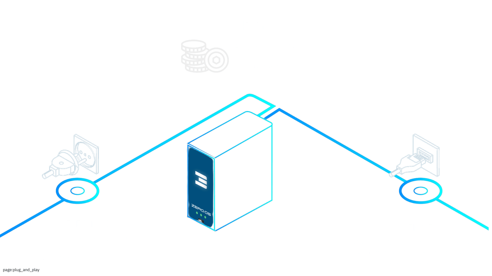
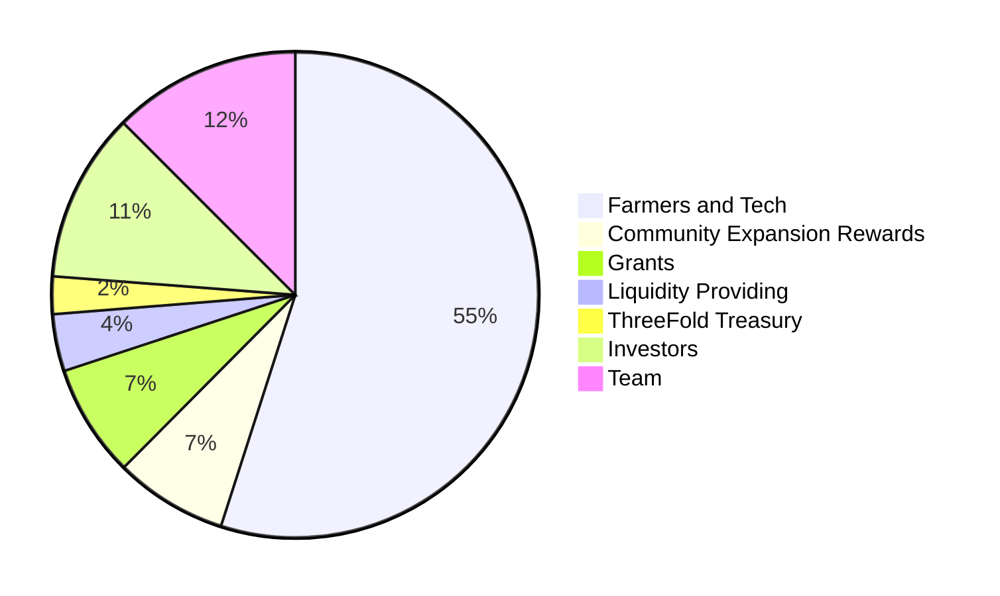

# Tokenomics



INCA is our utility like token empowering our ThreeFold grid.

Users use INCA tokens to deploy web solutions on top of the ThreeFold grid

- compatible with any web2, web3 and web4 solution
- [more info see here](use.md)

Farmers generate INternet CApacity and earn INCA tokens:

- Proof of Capacity: 
  - rewards are available upto 40m INCA per month to reward Farmers to deploy capacity on strategic locations
- Proof of Utilization: 
  - 80% of the INCA as used to buy the Internet Capacity goes to Farmers and their Farming Pools.


## INCA = **IN**ternet **CA**pacity

The **INCA token** allows anyone, anywhere, to access the ThreeFold ecosystem. 

- **ThreeFold V4** is a self-healing data, network, and cloud Internet infrastructure laying the foundation for Web4. 
- It is composed of nodes, routers, and phones, all connected to the **ThreeFold Network** and compatible with the current Internet.

### Expansion Phase of the Grid

ThreeFold is now entering the **expansion phase** of the grid, aiming to grow to millions of nodes. To achieve this bold goal, we are launching the **INCA token**, the continuation of the **ThreeFold Token (TFT)**:

- **TFT**, capped at 1 billion tokens, has supported us for years, enabling the development of the most advanced and complete decentralized cloud engine.
- Our new token, **INCA**, continues TFT's legacy. Each TFT can be converted into INCA on a **1:1 basis**, with **vesting over 18 months**.
- **INCA** is our **DePIN token** (Decentralized Physical Infrastructure Network) that will fund the expansion to a planetary scale.

> **Note:** Currently, TFT is available on Stellar, Ethereum and BNB Smart Chain. The liquidity and the market cap of TFT are low. While it has not been actively promoted, it reflects the foundational work of the existing ThreeFold Community. **INCA** serves as our launch token for potentially one of the largest and most meaningful projects in the DePIN space.

### Technology and Tokenomics

- The technology behind ThreeFold is **rock solid**, tested for years on mainnet. With INCA, we now enter the expansion phase to grow the grid to millions of nodes.
- **Liquidity optimization** is a key goal, enabled through an innovative, fiat-ready, and cross-chain marketplace.
- Over **70% of TFT** is allocated to the **community**, ensuring that INCA's tokenomics support **organic expansion** and provide resources for ThreeFold community members to thrive and build.
- The **INCA release** guarantees a **fair and resilient distribution**, fostering a strong and sustainable ecosystem.

ThreeFold V4, powered by INCA, represents a transformative step toward a decentralized, scalable, and resilient future for the Internet. Together, we are building the foundation for **Web4**.


## Basics of the Tokenomics

### Distribution


The ThreeFold INCA token distribution (includes the TFT) is carefully crafted to ensure a major allocation to the community. There can never be more than 4 billion tokens.

By prioritizing community growth, we're creating a collaborative environment where everyone can benefit from their contributions and participate in the project's success. This balanced distribution ensures that a significant amount of tokens is dedicated to the community, creating opportunities for growth and development within our ecosystem.




- **55%: Farmers and Tech**
  - People expanding the network with Router & Node capacity over the multiple releases
  - 18.1%: Farmers & Tech ThreeFold Grid 1-3 (+95% minted, Nov 2024)
  - 36.9%: Farmers ThreeFold Grid 4+ (0% minted, Nov 2024)
- **7.5%: Community Expansion Rewards**
  - Promotion of the TFGrid, Marketing Activities, ... 
- **7.5%: Grants**
  - We want to expand and build our project together with the community
- **3.8%: Liquidity Providing**
  - DEX, Exchanges, etc.
- **2.5%: ThreeFold Treasury**
- **11.3%: Investors**
- **12.5%: Team**


> Do note this table is still under deliberation and can change

## INCA Token

The ThreeFold INCA tokenomics for the ThreeFold Grid 4.0 has been designed to promote an active ecosystem of cloud users, farmers, and validators. It presents a robust liquidity strategy that ensures seamless transfers and secure transactions within our cloud marketplace. Furthermore, by allocating 40 million tokens per month (averaged out) for farming grants, we're empowering individuals and organizations to contribute to the grid's growth and development.

The proof-of-utilization rewards are distributed in a simpler manner:

- 60% goes to the farmer hosting the node
  - As a reward to provide resources to users
- 20% goes to the Farming Pool
  - As a reward to provide support, SLA, etc.
- 20% to ThreeFold, Guardians, Validators
  - As a reward to host, stabilize and secure the grid

The following chart provides an overview of the INCA ecosystem:

```mermaid
flowchart TD
    A[Cloud User] -->|CHF/EUR/...| B(CLOUD MARKET PLACE<br>Discount based on position<br>in TF Liquidity Pool.)
    A[Cloud User] -->|CHF/EUR/...| B2((ThreeFold<br>Liquidity Pool))
    B2 -->|TFT or INCA| B
    B -->|TFT or INCA| C{Proof of Utilization}
    G[FARMING GRANTS<br>40m Tokens / Month]-->  I{Proof of Capacity<br>uptime, location, ...} --> D
    C -->|60%| D[ThreeFold Farmers]
    C -->|20%| E[Farming Pool]
    C -->|20%| F[ThreeFold, Guardians, Validators]
  ```

## Get INCA Tokens

There are only two ways to get INCA tokens. 

- You can reserve an INCA node to be among the first farmers out there to farm newly minted INCA. 
- You can farm the remaining TFT on ThreeFold Grid V3 and convert them to INCA with a one-to-one correspondance.
