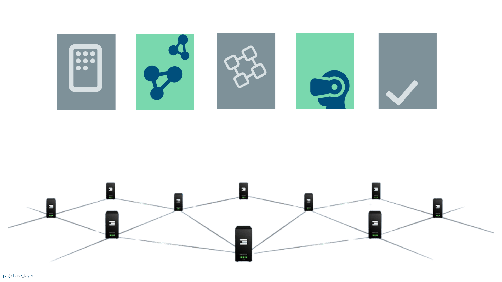
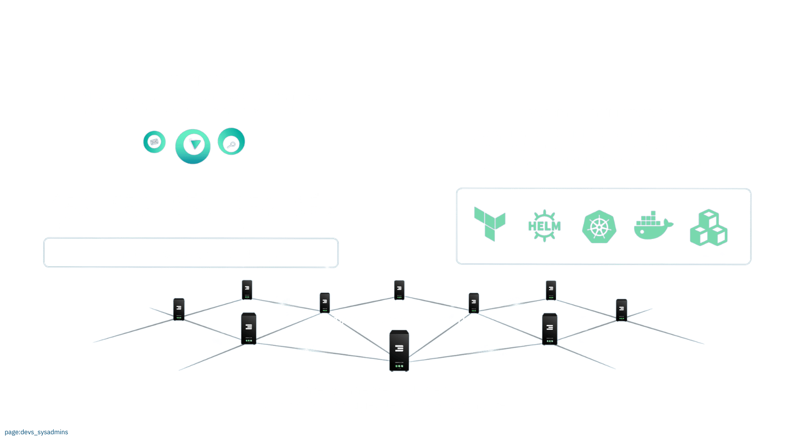
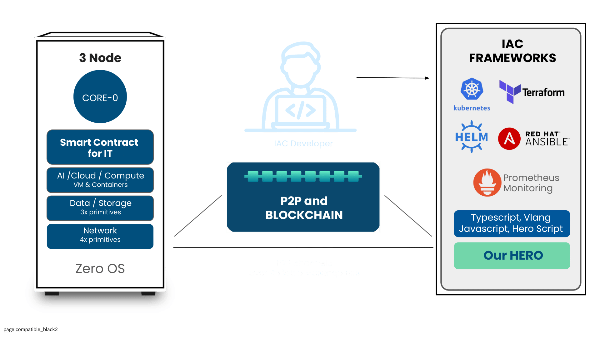

# How to Use

The current grid is usable for people who have some technical background know how to use cloud.

- Our current deployment is in more than 50 countries and has plenty of features.

We are working on generation 4 which will have following additional features:

- Service Level Management (as a user of the Internet capacity you get a guarantee from the farmer)
- Farming Pools (pools of capacity with defined service level and pricing)
- Dynamic pricing, each farmer/farming pool can define their own pricing in line to service levels and performance.
- Development platform for Web4 which is an agent centric paradigm of the future.

### Which Workloads

Any AI, web2/3, Blockchain app can be deployed today.

### For Who

Developers, as well as system administrators, can use the ThreeFold Grid.

Today, system administrators already have access to a large variety of tools to get started today (see below).

> *On 12-12-2024, we will announce what developers can build on top of the ThreeFold Grid.*

A true Web4 system must be flexible, enabling anyone, anywhere, to build on top of it.

### System Administrators, Web2/3 Enthusiasts

ThreeFold has made the ThreeFold grid compatible with standards as used today in the Cloud landscape.

You can deploy

- Virtual Machines
- Containers (compatible with docker)
- Kubernetes Clusters (compatible with the world) but with additional network capabilities.
- multiple network technologies connect the virtual machines & containers.
- AI workloads (use GPU from the Containers or Virtual Machines)
- Web Gateways: connect your running workload to the Internet
- Web3 workloads, e.g. blockchain validators, ... 
- ... anything which can run on linux today can run on top of the ThreeFold Grid

If you know how to script then you can build wonderful automated solutions on top of the grid.

> [All required information can be found in our manual.](https://manual.grid.tf/documentation/system_administrators/system_administrators.html)
