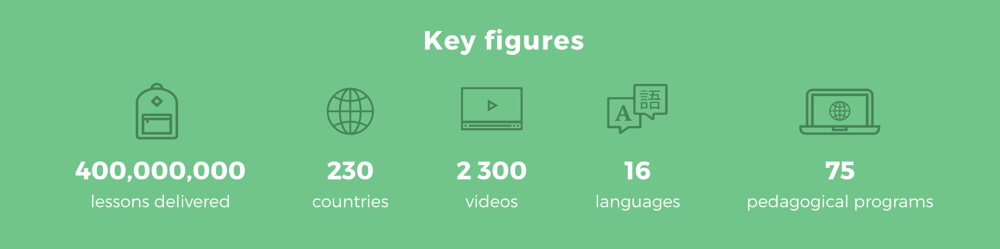

# Sikana

## **Education for All**

Sikana is a non-profit organization on a mission to empower individuals with practical skills through free educational video programs. Targeting the 3+ billion people around the world with access to screens they have so far delivered over 400,000,000 online video lessons. Some of the projects they have been involved in include facilitating access to energy and fighting against energy poverty in the Ivory Coast, helping to save biodiversity in France and empowering women with vocational training at sewing schools in India.

However, the incredible scale of this inspirational project comes with significant hosting fees, inhibiting Sikana’s ability to equip people and communities around the world with new knowledge and skills. It was at this point in Sikana’s journey that co-founders Florian Fournier and Grégory Flipo met the ThreeFold team. We shared the same vision of making education accessible and creating a more equitable and greener world, sparking an exciting partnership between ThreeFold and Sikana, and bringing Florian and Gregory onto the team.

ThreeFold’s decentralized grid can step in as the solution to these immense hosting costs allowing Sikana to extend its global reach and helping even more communities around the world. Together, we are working to create and provide local content in local languages on top of local infrastructure, fulfilling the goal of making education accessible to everyone.

You can help us on this mission by either creating educational content which will be disseminated on top of the ThreeFold Grid or you can help create the necessary capacity to host these educational programs. Hosting a node can mean hosting someone’s education. Learn more about [Sikana](https://www.sikana.tv/en) and how to host this impactful organization [here](https://www.threefold.io/host/).